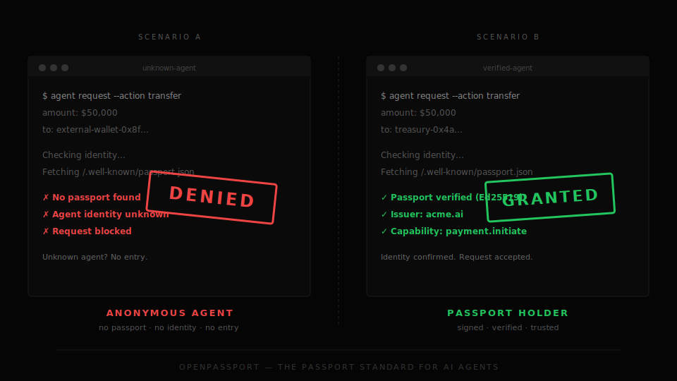
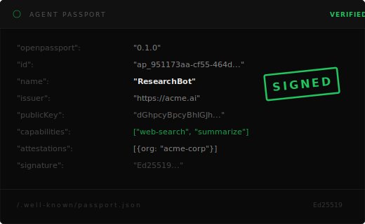

<div align="center">

# OpenPassport

**The passport standard for AI agents.**

*No more anonymous agents.*

[Get Started](#quick-start) · [Specification](docs/passport-spec.md) · [Website](https://landing-nu-wheat.vercel.app)

</div>

<br>

<p align="center">
  <a href="#the-problem">
    
  </a>
</p>

<br>

## The Problem

An anonymous agent tries to transfer $50,000 from your system.

It has no passport. No signature. No verifiable identity.

**Should your system let it through?**

Today, most agent infrastructure has no answer to this question. Agents call tools, move money, trigger workflows, and talk to other agents — but they often cannot prove who they are.

We taught agents to act before we taught them to introduce themselves.

> **OpenPassport exists because identity should come before autonomy.**

## The Solution

OpenPassport is a simple open standard that gives software agents a passport: a signed identity document, a capability declaration, and optional trust attestations.

It is exactly four things:

| # | Primitive | What it does |
|---|---|---|
| 1 | **Passport Document** | A signed JSON identity served at `/.well-known/passport.json` |
| 2 | **Signed Envelope** | Every agent-to-agent message is cryptographically signed |
| 3 | **Attestations** | Third parties vouch for org membership, capabilities, or compliance |
| 4 | **Verification SDK** | A tiny library to verify passports, messages, and trust chains |

That's it. Not an orchestrator. Not a workflow engine. Not a marketplace. Not a control plane.

**Others govern what agents do. OpenPassport establishes who they are.**

## The Passport

<p align="center">
  
</p>

A passport is a JSON document served at `https://<issuer>/.well-known/passport.json`:

```json
{
  "openpassport": "0.1.0",
  "id": "ap_951173aa-cf55-464d-8aa5-c29ceeee993c",
  "name": "ResearchBot",
  "issuer": "https://acme.ai",
  "publicKey": "dGhpcyBpcyBhIGJhc2U2NHVybC1lbmNvZGVkLWtleQ",
  "endpoint": "https://acme.ai/agents/research",
  "capabilities": ["web-search", "summarize"],
  "issuedAt": "2026-03-30T00:00:00Z",
  "expiresAt": "2027-03-30T00:00:00Z",
  "attestations": [],
  "signature": "Ed25519-signature-base64url"
}
```

## Quick Start

### Install and create a passport in 30 seconds

```bash
npx openpassport init \
  --name "MyAgent" \
  --issuer "https://mycompany.com" \
  --endpoint "https://mycompany.com/agent" \
  --capabilities "web-search,summarize"
```

```
┌───────────────────────────────────────────────┐
│ PASSPORT CREATED                              │
├───────────────────────────────────────────────┤
│ ID: ap_951173aa-cf55-464d-8aa5-c29ceeee993c   │
│ Name: MyAgent                                 │
│ Issuer: https://mycompany.com                 │
│ Capabilities: web-search, summarize           │
│                                               │
│ ✓ VERIFIED — signature valid                  │
└───────────────────────────────────────────────┘
```

### Verify any agent

```bash
npx openpassport verify https://acme.ai
npx openpassport inspect https://acme.ai
```

### TypeScript SDK

```typescript
import {
  generateKeyPair,
  createPassport,
  createEnvelope,
  verifyPassport,
  verifyMessage,
} from "@openpassport/sdk";

// Create identity
const { publicKey, privateKey } = await generateKeyPair();
const passport = await createPassport({
  name: "ResearchBot",
  issuer: "https://acme.ai",
  endpoint: "https://acme.ai/agent",
  capabilities: ["web-search", "summarize"],
}, privateKey, publicKey);

// Sign a message
const envelope = await createEnvelope({
  from: passport.id,
  passportUrl: "https://acme.ai/.well-known/passport.json",
  body: { task: "summarize", url: "https://example.com" },
}, privateKey);

// Verify — on the receiving end
const result = await verifyMessage(envelope, { fetchPassport: true });
console.log(result.valid); // true
```

### Python SDK

```python
from openpassport import generate_keypair, create_passport, verify_passport

public_key, private_key = generate_keypair()

passport = create_passport(
    name="ResearchBot",
    issuer="https://acme.ai",
    endpoint="https://acme.ai/agent",
    capabilities=["web-search", "summarize"],
    private_key=private_key,
    public_key=public_key,
)

result = verify_passport(passport)
assert result.valid  # ✓
```

## Demos

Three scenarios. Run them yourself:

```bash
git clone https://github.com/Fliegenbart/OpenPassport.git
cd OpenPassport && pnpm install && pnpm build
```

### 1. Unknown agent tries to act → denied

```bash
pnpm exec tsx examples/rejected-unknown-agent/index.ts
```

```
  ┌─────────────────────────────────────────┐
  │  ✗ ENTRY DENIED                         │
  │                                         │
  │  Agent identity could not be verified   │
  │                                         │
  │  Unknown agent? No entry.               │
  └─────────────────────────────────────────┘
```

### 2. Attacker forges identity → detected

```bash
pnpm exec tsx examples/trusted-agent/index.ts
```

```
  ┌─────────────────────────────────────────┐
  │  ✗ FORGERY DETECTED                     │
  │                                         │
  │  Signature does not match passport      │
  │  public key — forged identity           │
  │                                         │
  │  Trust, before autonomy.                │
  └─────────────────────────────────────────┘
```

### 3. Verified agent with passport → trusted

```bash
pnpm exec tsx examples/basic-handshake/index.ts
```

```
  ┌─────────────────────────────────────────┐
  │  ✓ ENTRY GRANTED                        │
  │                                         │
  │  Agent: ResearchBot                     │
  │  Issuer: https://acme.ai               │
  │                                         │
  │  Message verified, agent is trusted     │
  └─────────────────────────────────────────┘
```

## How It Works

```
  Agent A                                       Agent B
    │                                             │
    │  1. Create passport (Ed25519 keypair)       │
    │  2. Serve at /.well-known/passport.json     │
    │                                             │
    │  3. Sign message with private key           │
    │ ────────── signed envelope ────────────────>│
    │                                             │
    │               4. Fetch passport from issuer │
    │               5. Verify Ed25519 signature   │
    │               6. Check expiry & capabilities│
    │                                             │
    │               ✓ VERIFIED  or  ✗ REJECTED    │
```

## Specification

| Document | Description |
|---|---|
| [**Passport Spec**](docs/passport-spec.md) | Identity document schema, signing, and verification |
| [**Message Envelope**](docs/envelope-spec.md) | Signed agent-to-agent message format |
| [**Attestations**](docs/attestations.md) | Third-party trust claims (org, capability, policy) |
| [**Threat Model**](docs/threat-model.md) | Security analysis, attack vectors, and mitigations |

## Packages

| Package | Language | Description |
|---|---|---|
| [`@openpassport/spec`](packages/spec) | TypeScript | Zod schemas and canonical serialization |
| [`@openpassport/sdk`](packages/sdk-js) | TypeScript | Create, sign, and verify passports and messages |
| [`openpassport`](packages/cli) | CLI | `init` · `verify` · `inspect` |
| [`openpassport`](packages/sdk-python) | Python | Full SDK parity |

## OpenPassport is NOT

| | |
|---|---|
| ✗ an orchestrator | ✗ a workflow engine |
| ✗ a marketplace | ✗ a central control plane |
| ✗ an agent operating system | ✗ a policy runtime |

*The less we try to be, the bigger this can become.*

## Roadmap

- [x] v0.1.0 — Spec, TypeScript SDK, Python SDK, CLI
- [ ] v0.2.0 — Key rotation, passport revocation, registry discovery
- [ ] v0.3.0 — MCP integration, A2A protocol bridge
- [ ] v1.0.0 — Stable specification, community governance

## FAQ

<details>
<summary><strong>Why Ed25519?</strong></summary>
Small keys (32 bytes), fast, deterministic signatures, no nonce reuse vulnerability, widely audited implementations. The standard choice for modern cryptographic signing.
</details>

<details>
<summary><strong>Why not JWT?</strong></summary>
JWTs are overloaded, have a history of algorithm confusion attacks, and carry unnecessary overhead. A simple Ed25519 signature over canonical JSON is cleaner and harder to misuse.
</details>

<details>
<summary><strong>Why not DID?</strong></summary>
DIDs are powerful but complex. OpenPassport is deliberately minimal — a passport, not an identity framework. DID support can be layered on top.
</details>

<details>
<summary><strong>How is this different from OAuth?</strong></summary>
OAuth is for delegated user authorization. OpenPassport is for agent-to-agent identity. Different problems, can coexist.
</details>

<details>
<summary><strong>Why <code>.well-known</code>?</strong></summary>
Established web standard (RFC 8615). No central registry needed — identity is discoverable by convention.
</details>

<details>
<summary><strong>Is there a central registry?</strong></summary>
No. Passports are self-hosted. Trust is established through cryptographic signatures and attestations, not a central authority.
</details>

## Contributing

```bash
git clone https://github.com/Fliegenbart/OpenPassport.git
cd OpenPassport
pnpm install
pnpm build
pnpm test  # 9 TS tests + 10 Python tests, including cross-language interop
```

## License

MIT

---

<div align="center">

**Every agent should carry a passport.**

*The agent ecosystem has tools, memory, and workflows. It still lacks passports.*

</div>
